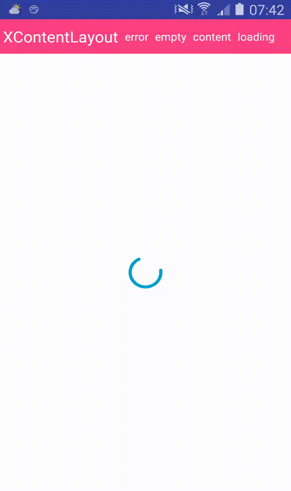

# XRecyclerView

对RecyclerView的封装，功能强大、使用简单、扩展性强。该库主要分成三部分：**RecyclerAdapter**、**XRecyclerView**、**XRecyclerContentLayout**

>该库在商业项目中历经一年多时间打磨，欢迎star、fork，后期会有更多分享，期待您的建议和关注。


<p align="center">
  
</p>

## 使用

* Gradle ： **compile 'cn.droidlover:XRecyclerView:1.0.0'**
* Github ： [**XRecyclerView**](https://github.com/limedroid/XRecyclerView)

## RecyclerAdapter

RecyclerAdapter简化了Adapter的开发，封装了一些常用的逻辑，包括数据集合操作、接口监听RecyclerItemCallback可以满足99%的需求。

### 使用示例

```java
public class TestRecAdapter extends RecyclerAdapter<TestRecAdapter.Item, TestRecAdapter.ViewHolder> {

	@Override
    public ViewHolder onCreateViewHolder(ViewGroup parent, int viewType) {
      
    }

	@Override
    public void onBindViewHolder(ViewHolder holder, int position) {
        
    }
}
```


## XRecyclerView

XRecyclerView是对RecyclerView的封装，其主要特性包括:

* 一行代码添加、删除、修改Header或者Footer
* 一行代码添加默认的上拉加载效果
* 一行代码切换自定义上拉加载效果
* 一行代码轻松添加LayoutManager
* 一行代码添加divider
* Adapter规范及封装**RecyclerAdapter**

### 使用示例

```java
recyclerView.verticalLayoutManager(this)        //设置layoutManager
            .setAdapter(adapter);                   //设置Adapter
recyclerView.horizontalDivider(R.color.x_red, R.dimen.divider_height);  //设置divider
recyclerView.setOnRefreshAndLoadMoreListener(new XRecyclerView.OnRefreshAndLoadMoreListener() { //设置刷新和上拉加载监听
            @Override
            public void onRefresh() {
                loadData(1);
            }

            @Override
            public void onLoadMore(int page) {
                loadData(page);
            }
        });
recyclerView.useDefLoadMoreView();      //使用默认的上拉刷新样式
recyclerView.addHeaderView(headView);       //添加header
recyclerView.addFooterView(footview);       //添加footer
recyclerView.removeHeaderView(headview);    //删除header
recyclerView.removeFooterView(footview);    //删除footer
```

## XRecyclerContentLayout

XRecyclerContentLayout继承了[**QTContentLayout**](https://github.com/limedroid/QTContentLayout)，可自定义Loading、Error、Empty、Content四种显示状态，满足了绝大部分需求.

### 使用示例

```xml
<cn.droidlover.xrecyclerview.XRecyclerContentLayout
        android:id="@+id/contentLayout"
        android:layout_width="match_parent"
        android:layout_height="match_parent"
        app:recyclerBackgroundColor="#f5f5f5"
        app:recyclerScrollbarNone="true"
        app:recyclerScrollbarStyle="outsideOverlay" />
```

```java
contentLayout.loadingView(new LoadingView(this));
             .errorView(new ErrorView(this));
             .emptyView(new EmptyView(this));

contentLayout.showLoading();
contentLayout.showError();
contentLayout.showEmpty();
contentLayout.showContent();
```

### 自定义实现XRecyclerContentLayout

在XRecyclerContentLayout中内置了SwipeRefreshLayout下拉刷新样式，您也可以自定义实现XRecyclerContentLayout，只需实现XRecyclerView.StateCallback接口即可.

```java
public interface StateCallback {
        void notifyEmpty();     //数据为空

        void notifyContent();   //显示contentview

        void refreshState(boolean isRefresh);   //更新刷新状态

        void refreshEnabled(boolean isEnabled); //刷新是否可用
    }
```


 

